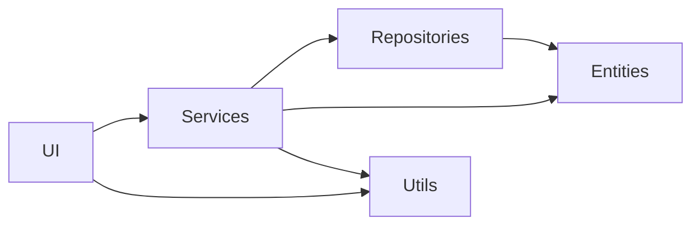
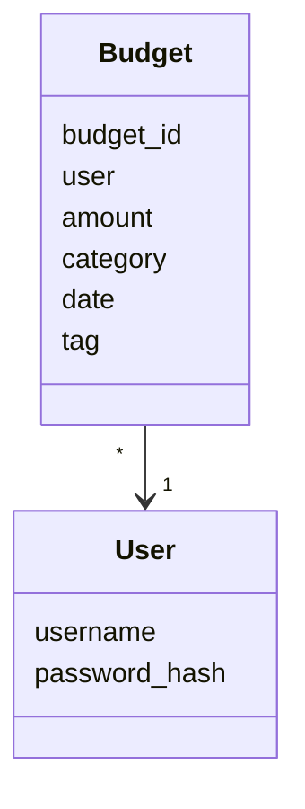
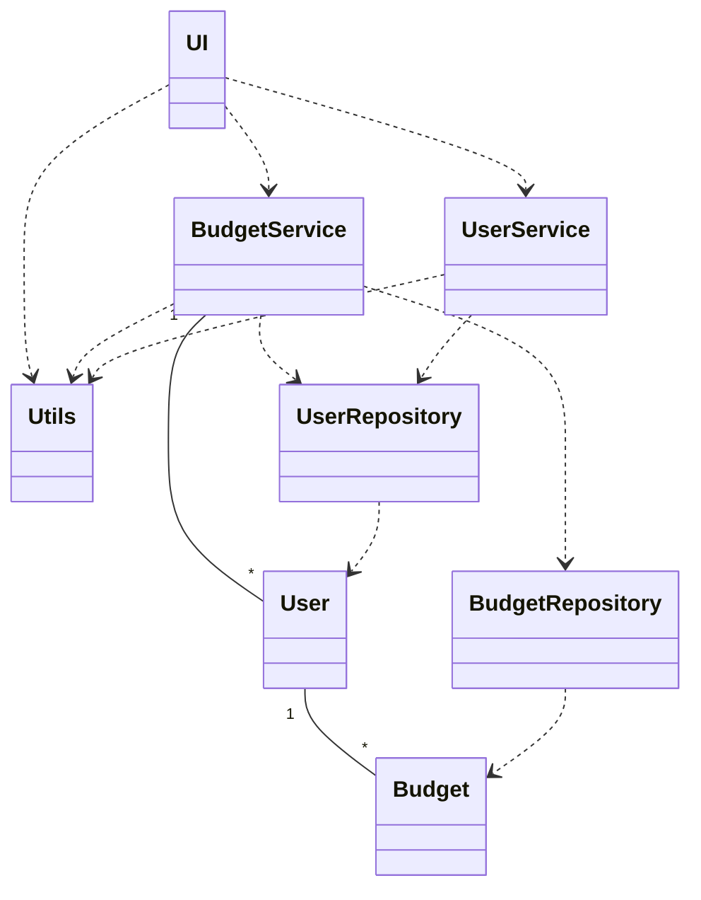
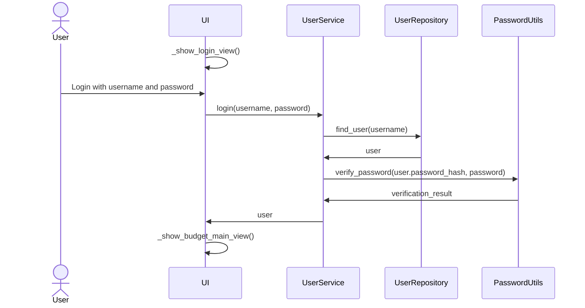
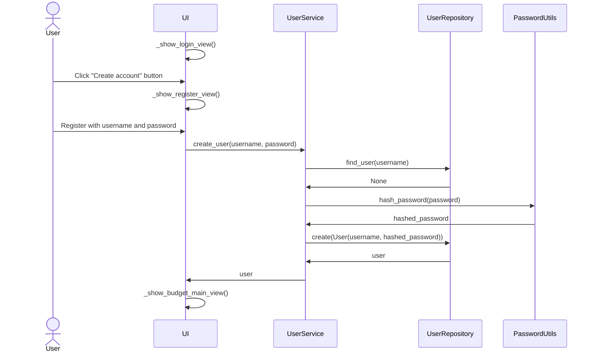
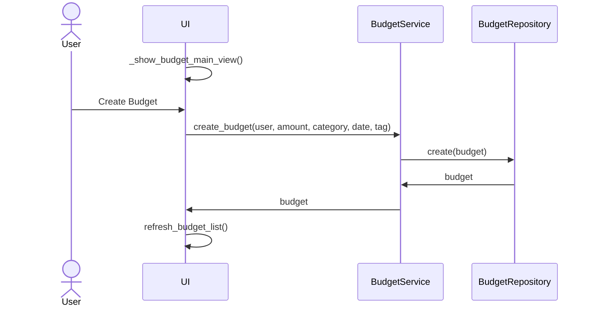
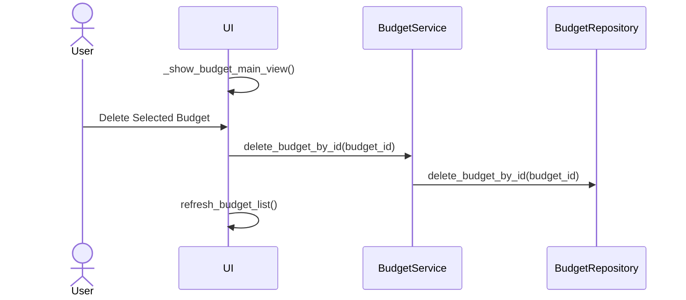

# Arkkitehtuurikuvaus

## Pakkausrakenne

Sovelluksen rakenteessa on kerrokset `UI`, `Services`, `Repositories` ja `Entities`. `UI` kerros kommunikoi `Services` kerroksen kanssa, `Services` `Repositories` ja `Entities` kanssa, sekä `Repositories` `Entities` kanssa. Sovelluksessa on myös `Utils` kerros, jota käyttävät `UI` ja `Services` kerros.

## Tietojen tallennus

Luokat `BudgetRepository` ja `UserRepository` ovat vastuussa sovelluksen tietojen tallentamisesta. Molemmat käyttävät SQLite-tietokantaa, jonka taulut alustetaan tiedostossa [initialize_database.py](../src/initialize_database.py). Tiedostot sijaitsevat juurihakemiston `data` hakemistossa, ja tiedostojen nimet on määritelty [.env](../.env)-tiedostossa. Testauksessa tiedostojen nimet on määritelty [.env.test](../.env.test)-tiedostossa.

Tietokannassa käyttäjät tallennetaan tauluun `users`, jossa on sarakkeina käyttäjän nimi ja hajautettu salasana. Budjetit tallennetaan tauluun `budgets`, jossa on sarakkeina `id`, budjetin tunnistin, `user`, omistajan käyttäjänimi, `amount`, budjetin määrä, `category`, budjetin kategoria (income/expense), `date`, budjetin päivämäärä, ja `tag`, budjetin tägi, tai luokittelu.

## Käyttöliittymä

Sovelluksessa on näkymät kirjautumiselle, rekisteröitymiselle, budjettien tarkastelulle, budjettien lisätiedoille, sekä pieni popup näkymä budjettien lisäykselle.

Näkymien näyttämisen ja vaihtamisen hoitaa `UI`-luokka. Käyttöliittymä kutsuu pääasiassa luokkien `UserService` ja `BudgetService` metodeja, mutta sisältää myös metodin käyttäjän syötteen validoinnille. Käyttöliittymään kuuluu myös metodit `generate_budget_graph` ja `generate_pie_chart`, jotka hoitavat kuvaajien piirtämisen.

Budjettilistaa päivittäessä kutsutaan metodia refresh_budget_list(), jolla näytetään käyttäjälle uusin päivitys listasta.

## Sovelluslogiikka

Sovelluksen tietomalli muodostuu luokista `User` ja `Budget`. Yhdellä käyttäjällä voi olla monta budjetti-oliota:

Sovelluslogiikan ja käyttöliittymän yhteydestä vastaavat luokat `BudgetService` ja `UserService`. Nämä luokat kutsuvat repositorio-luokkien `BudgetRepository` ja `UserRepository` metodeja, joilla sovelluksen tietokantaa päivitetään.

Ohjelman osien suhteita kuvaa seuraava kaavio:

## Käynnistys ja kirjautuminen

Kun sovellus käynnistetään ja käyttäjä kirjautuu sisään oikeilla tunnuksilla, toimii sovellus näin:

Käynnistyksen yhteydessä UI kutsuu _show_login_view()-metodia, jolla näytetään kirjautumisnäkymä käyttäjälle. Käyttäjän painamalla kirjautumispainiketta, kutsuu UI `UserService` palvelun login()-metodia käyttäjätunnuksella ja salasanalla. `UserService` kutsuu `UserRepository` luokan find_user()-metodia parametrina käyttäjänimi, joka palauttaa `User` olion, jos käyttäjä löytyy. `UserService` vahvistaa vielä salasanan `PasswordUtils` moduulilta, joka palauttaa vahvistuksen tuloksen. `UserService` palauttaa `User` olion, ja UI ohjaa käyttäjän sovelluksen päänäkymään metodilla _show_budget_main_view().

## Rekisteröityminen

Kun käyttäjä käynnistää sovelluksen ja siirtyy luomaan uuden käyttäjän, etenee sovellus seuraavasti:

UI kutsuu _show_login_view()-metodia, joka näyttää käyttäjälle kirjautumisnäkymän. Käyttäjä painaa "Create account" -painiketta, jolloin UI kutsuu _show_register_view()-metodia, joka näyttää rekisteröitymisnäkymän. UI kutsuu `UserService`-palvelun create_user()-metodia, jossa käyttäjätunnus ja salasana annetaan parametreina. `UserService` kutsuu `UserRepository`-luokan find_user()-metodia tarkistaakseen, onko käyttäjätunnus jo olemassa. `UserRepository` ei löydä käyttäjää, joten se palauttaa None. `UserService` kutsuu `PasswordUtils` moduulin metodia hash_password(), joka palauttaa hajautetun salasanan. `UserService` luo uuden käyttäjän User-olion muodossa, käyttäjätunnuksella ja hajautetulla salasanalla. UserService kutsuu `UserRepository`-luokkaa create()-metodilla luodakseen uuden käyttäjän tietokantaan. `UserRepository` palauttaa luodun käyttäjän UserService-palvelulle. UserService palauttaa käyttäjän UI:lle. UI ohjaa käyttäjän sovelluksen päänäkymään kutsumalla _show_budget_main_view()-metodia.

### Budjettien luominen

Kun käyttäjä siirtyy sovelluksen päänäkymään ja luo uuden budjetin oikeilla arvoilla, toimii sovellus näin:

UI kutsuu `BudgetService` metodia create_budget() annetuilla arvoilla. `BudgetService` kutsuu luokkaa `BudgetRepository` metodilla create(), ja onnistuessa `BudgetRepository` palauttaa `Budget`-olion. `BudgetService` edelleen palauttaa `Budget` olion UI:lle, ja UI päivittää budjettilistan metodillaan refresh_budget_list().

### Budjettien poistaminen

Kun käyttäjä valitsee päänäkymän pöydällä olevan budjetin ja painaa nappia "Delete Selected Budget", toimii sovellus nin:

UI kutsuu `BudgetService` metodia delete_budget_by_id() pöydältä valitun budjetin id:llä. `BudgetService` kutsuu luokkaa `BudgetRepository` metodilla delete_budget_by_id() ja lopuksi UI päivittää budjettilistan metodillaan refresh_budget_list().
