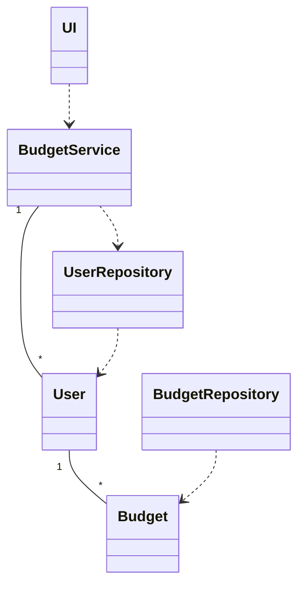
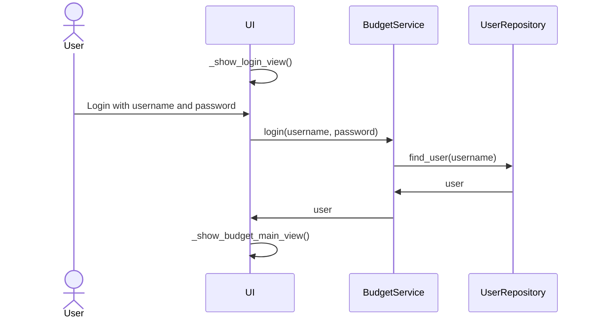
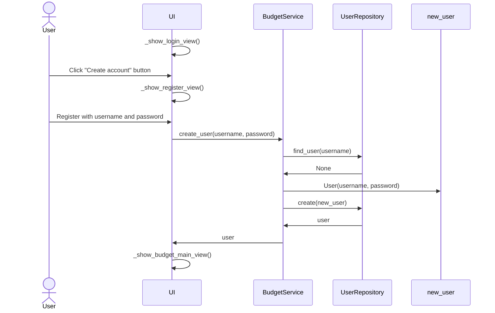

# Arkkitehtuurikuvaus

## Ohjelman alustava rakenne

```mermaid
  classDiagram
    UI  ..> BudgetService
    BudgetService ..> UserRepository
    BudgetService "1" -- "*" User
    User "1" -- "*" Budget
    UserRepository ..> User
    BudgetRepository ..> Budget
```

## Kirjautumisen sekvenssikaavio

```mermaid
sequenceDiagram
    actor User
    participant UI
    participant BudgetService
    participant UserRepository
    UI->>UI: _show_login_view()
    User->>UI: Login with username and password
    UI->>BudgetService: login(username, password)
    BudgetService->>UserRepository: find_user(username)
    UserRepository->>BudgetService: user
    BudgetService->>UI: user
    UI->>UI: _show_budget_main_view()
```

## Rekisteröitymisen sekvenssikaavio

```mermaid
sequenceDiagram
    actor User
    participant UI
    participant BudgetService
    participant UserRepository
    participant new_user
    UI->>UI: _show_login_view()
    User->>UI: Click "Create account" button
    UI->>UI: _show_register_view()
    User->>UI: Register with username and password
    UI->>BudgetService: create_user(username, password)
    BudgetService->>UserRepository: find_user(username)
    UserRepository->>BudgetService: None
    BudgetService->>new_user: User(username, password)
    BudgetService->>UserRepository: create(new_user)
    UserRepository->>BudgetService: user
    BudgetService->>UI: user
    UI->>UI: _show_budget_main_view()
```