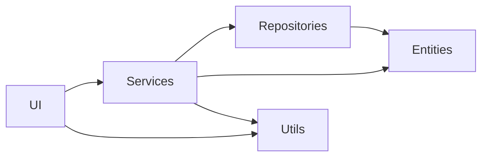
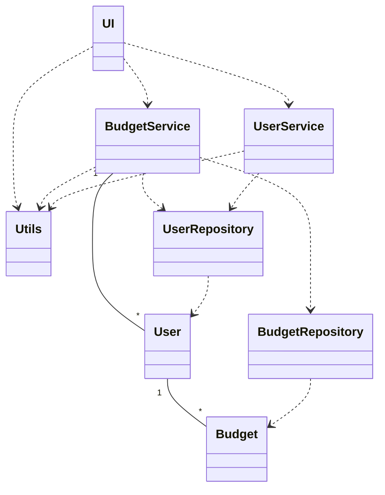
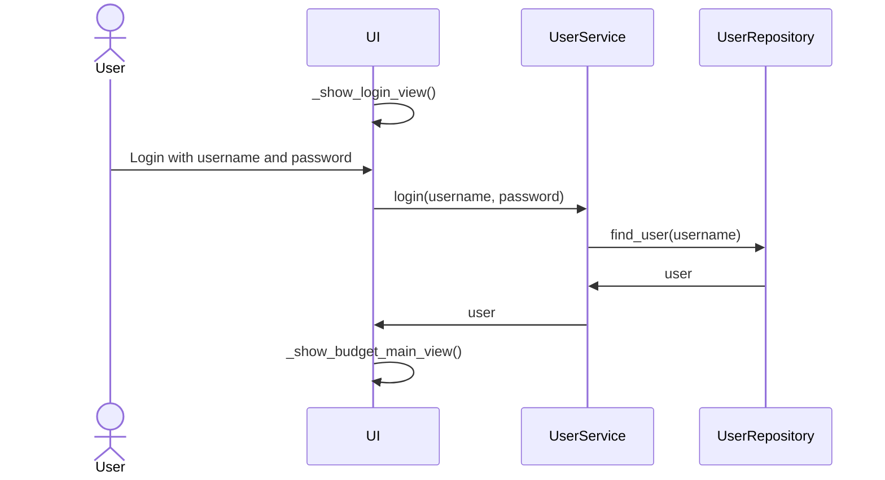
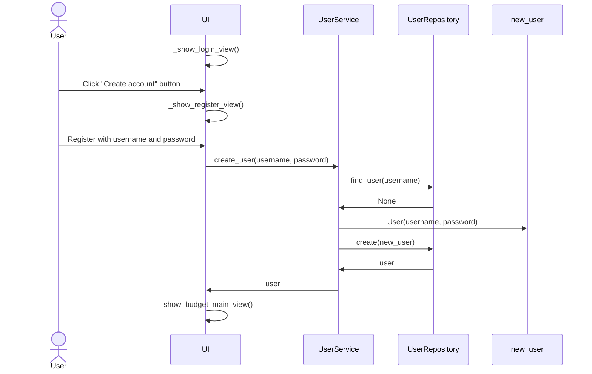
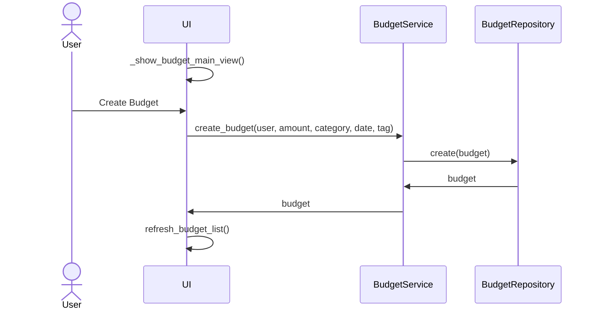
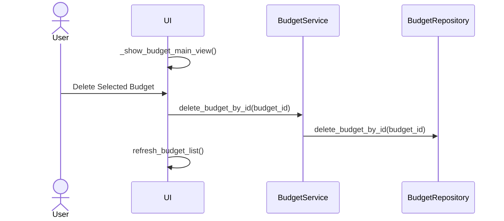

# Arkkitehtuurikuvaus

## Pakkausrakenne

Sovelluksen rakenteessa on kerrokset `UI`, `Services`, `Repositories` ja `Entities`. `UI` kerros kommunikoi `Services` kerroksen kanssa, `Services` `Repositories` ja `Entities` kanssa, sekä `Repositories` `Entities` kanssa. Sovelluksessa on myös `Utils` kerros, jota käyttävät `UI` ja `Services` kerros.

## Tietojen tallennus

Luokat `BudgetRepository` ja `UserRepository` ovat vastuussa sovelluksen tietojen tallentamisesta. Molemmat käyttävät SQLite-tietokantaa, jonka tablet alustetaan tiedostossa [initialize_database.py](../src/initialize_database.py). Tiedostot sijaitsevat juurihakemiston `data` hakemistossa, ja tiedostojen nimet on määritelty [.env](../.env)-tiedostossa. Testauksessa tiedostojen nimet on määritelty [.env.test](../.env.test)-tiedostossa.

## Sovelluslogiikka

## Käynnistys ja kirjautuminen

Käynnistyksen yhteydessä UI kutsuu _show_login_view()-metodia, jolla näytetään kirjautumisnäkymä käyttäjälle. Käyttäjän painamalla kirjautumispainiketta, kutsuu UI `UserService` palvelun login()-metodia käyttäjätunnuksella ja salasanalla. `UserService` kutsuu `UserRepository` luokan find_user()-metodia parametrina käyttäjänimi, joka palauttaa `User` olion, jos käyttäjä löytyy. `UserService` palauttaa tämän `User` olion, ja UI ohjaa käyttäjän sovelluksen päänäkymään metodilla _show_budget_main_view().

## Rekisteröityminen

UI kutsuu _show_login_view()-metodia, joka näyttää käyttäjälle kirjautumisnäkymän. Käyttäjä painaa "Create account" -painiketta, jolloin UI kutsuu _show_register_view()-metodia, joka näyttää rekisteröitymisnäkymän. UI kutsuu `UserService`-palvelun create_user()-metodia, jossa käyttäjätunnus ja salasana annetaan parametreina. `UserService` kutsuu `UserRepository`-luokan find_user()-metodia tarkistaakseen, onko käyttäjätunnus jo olemassa. `UserRepository` ei löydä käyttäjää, joten se palauttaa None. `UserService` luo uuden käyttäjän User-olion muodossa, käyttäjätunnuksella ja salasanalla. UserService kutsuu `UserRepository`-luokkaa create()-metodilla luodakseen uuden käyttäjän tietokantaan. `UserRepository` palauttaa luodun käyttäjän UserService-palvelulle. UserService palauttaa käyttäjän UI:lle. UI ohjaa käyttäjän sovelluksen päänäkymään kutsumalla _show_budget_main_view()-metodia.

## Käyttöliittymä

Sovelluksessa on näkymät kirjautumiselle, rekisteröitymiselle, budjettien tarkastelulle, budjettien lisätiedoille, sekä pieni popup näkymä budjettien lisäykselle.

### Budjettien luominen

### Budjettien poistaminen

