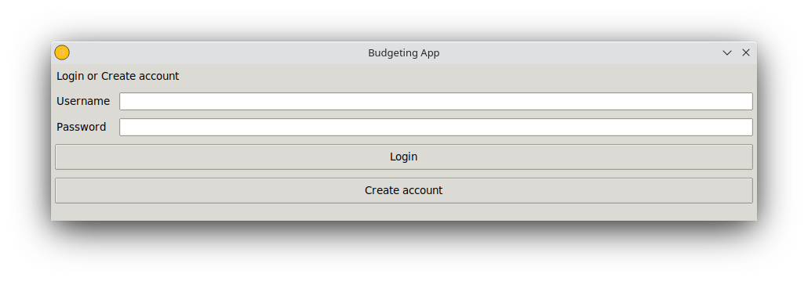
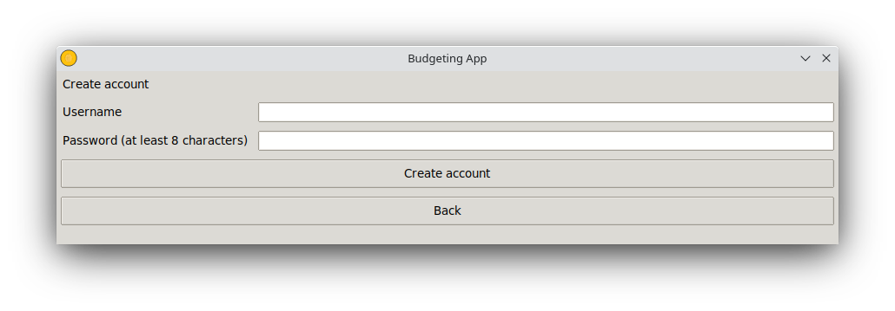
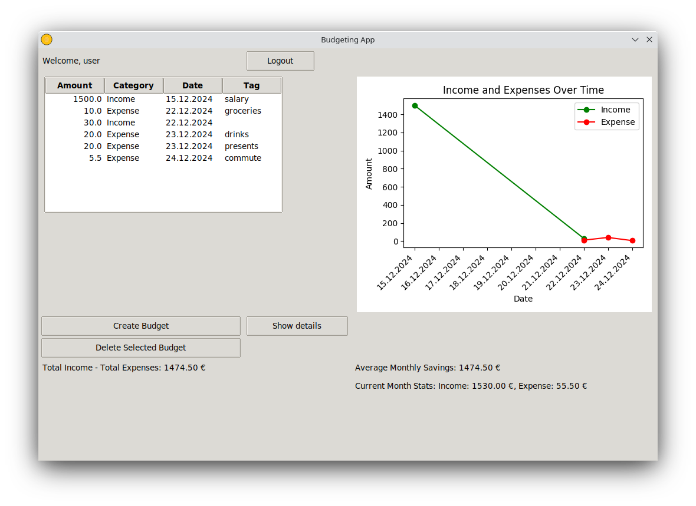

# Käyttöohje

Lataa viimeisin release [täältä](https://github.com/jensjvh/ot-harjoitustyo/releases).

## Konfigurointi

Luo .env tiedosto juurihakemistoon, joka sisältää seuraavan rivin:

```
DATABASE_FILENAME=database.sqlite
```

Testejä varten luo myös .env.test tiedosto, tällä sisällöllä:

```
DATABASE_FILENAME=test-database.sqlite
```

Voit myös määritellä näihin tiedostoihin oman tietokantasi nimen. Jos käytät olemassaolevaa SQLite tietokantaa, sen täytyy sijaita juurihakemiston data-kansiossa.

## Käynnistäminen

Asenna riippuvuudet komennolla

```bash
poetry install
```

Suorita komento jolla rakennetaan tietokanta:

```bash
poetry run invoke build
```

Sovelluksen käynnistys:

```bash
poetry run invoke start
```

Testit ja kattavuuden voi suorittaa komennoilla `poetry run invoke test`, `poetry run invoke coverage` ja `poetry run invoke coverage-report`.

## Kirjautuminen

Aluksi käyttäjä näkee kirjautumisnäkymän:



Näkymästä voi joko kirjautua sisään olemassaolevilla tunnuksilla ja painamalla login-painiketta, tai siirtyä rekisteröitymisnäkymään Create account -painikkeella.

## Rekisteröityminen



Rekisteröitymisnäkymässä voi luoda uuden käyttäjätilin uniikilla käyttäjänimellä ja vähintään kahdeksan merkkiä sisältävällä salasanalla. Käyttäjän salasana tallennetaan tietokantaan hajautettuna Argon2 -kirjastolla. Mikäli käyttäjänimi on käytössä tai salasana on liian lyhyt, ilmoittaa näkymä tästä virheviestillä.

Painamalla Create account -painiketta validilla syötteellä, käyttäjätili luodaan ja käyttäjä siirretään takaisin kirjautumisnäkymään. Painamalla Back -painiketta, voi siirtyä manuaalisesti takaisin kirjautumisnäkymään.

## Budjettinäkymä



Budjettinäkymässä voi lisätä budjetteja painikkeella Create Budget, poistaa luotuja budjetteja painikkeella Delete Selected Budget, kirjautua ulos Logout-painikkeella, tai siirtyä lisätietonäkymään Show details-painikkeella. Näkymässä on myös lista budjeteista, sekä menojen ja tulojen kuvaaja eri päiville. Näkymässä on myös muita lisätietoja, kuten kokonaistuloista vähennetyt kokonaismenot, kuukausisäästöjen keskiarvo, sekä menot ja tulot nykyiselle kuukaudelle.

## Budjetin luominen


Budjettia luodessa voi antaa budjetin määrän (Amount) enintään kahden desimaalin tarkkuudella, tai kokonaislukuna. Kategorian voi valita tuloksi tai menoksi dropdown-valikosta. Päivämäärä tulee olla muodossa PP.KK.VVVV. Päivämäärän voi joko kirjoittaa tai valita kalenterivalikosta. Budjetin tägi voi olla mikä tahansa enintään 10-kirjaiminen merkkijono. Budjetti luodaan Create-painikkeesta.

## Lisätietonäkymä


Lisätietonäkymässä on sama kuvaaja kuin budjettinäkymässä, sekä ympyräkaavio eri tägien menoille. Näkymässä on myös tiedot kokonaistuloista, kokonaismenoista, sekä kokonaissäästöistä. Ympyräkaavion alapuolella on tarkempi lista eri tägeihin kohdistuneista menoista.