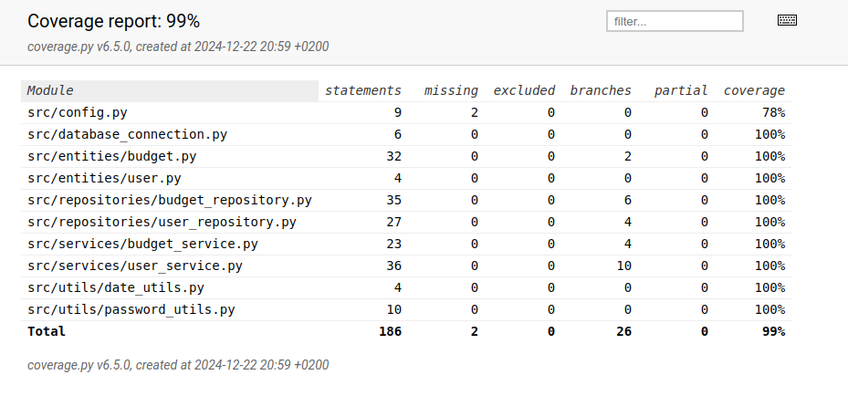

# Testausdokumentti

Ohjelman testaus on toteutettu yksikkö- ja integraatiotesteillä `unittest` kirjastolla. Ohjelman toiminnallisuutta ja käyttöliittymää on testattu manuaalisesti kokeilemalla erilaisia odotettuja ja odottamattomia syötteitä, sekä kokeilemalla, että eri näkymät toimivat odotetusti.

## Yksikkö- ja integraatiotestaus

### Entities

Entity-luokka `Budget` on testattu luokalla `TestBudget`.

### Utils

Utilities-moduulit on testattu luokissa `TestPasswordUtils` ja `TestDateUtils`.

### Sovelluslogiikka

Sovelluslogiikan luokat `BudgetService` ja `UserService` testataan niitä vastaavilla `TestBudgetService` ja `TestUserService` testiluokilla. Testeissä on käytetty sekä `.env.test`-tiedoston määrittelemää tietokantaa, sekä unittest-kirjaston `Mock` ja `MagicMock` luokkia.

### Repository-luokat

Luokat `BudgetRepository` ja `UserRepository` testataan `.env.test`-tiedostoon määritellyllä tietokannalla. Näitä testaavat luokat `TestBudgetRepository` ja `TestUserRepository`.

### Integraatiotestit

Luokassa `TestIntegration` on testattu sovelluksen käytön kannalta olennaisia toimintoja.

### Testauskattavuus

Testien kattavuusraportista on jätetty pois kaikki käyttöliittymään liittyvien ominaisuuksien testaus. Haarautumakattavuus muille osille on 99%

Testaamatta jäi `config.py`, josta jäi testaamatta pass kun kohdataan `FileNotFoundError`.

## Järjestelmätestaus

Järjestelmätestaus on toteutettu manuaalisesti. Sovellus on testattu dokumentaation käyttöohjeen kuvaamalla tavalla Linux-ympäristössä. Testejä on kokeiltu määrittelemällä env-tiedostoihin erilaisia tietokannan nimiä. Testeissä on myös kokeiltu rikkovatko tyhjät tai odottamattomat syötteet sovelluksen toiminnan, ja toimiiko sovellus kun tietoja ei ole vielä syötetty.

### Toiminnallisuudet

[Määrittelydokumentin](./vaatimusmaarittely.md) listaamat toiminnallisuudet on testattu. Käyttöohjeen kuvaamia ohjeita on myös kokeiltu olla noudattamatta, jolloin sovellus näyttää tekstillä, mitä käyttäjä on tehnyt väärin.