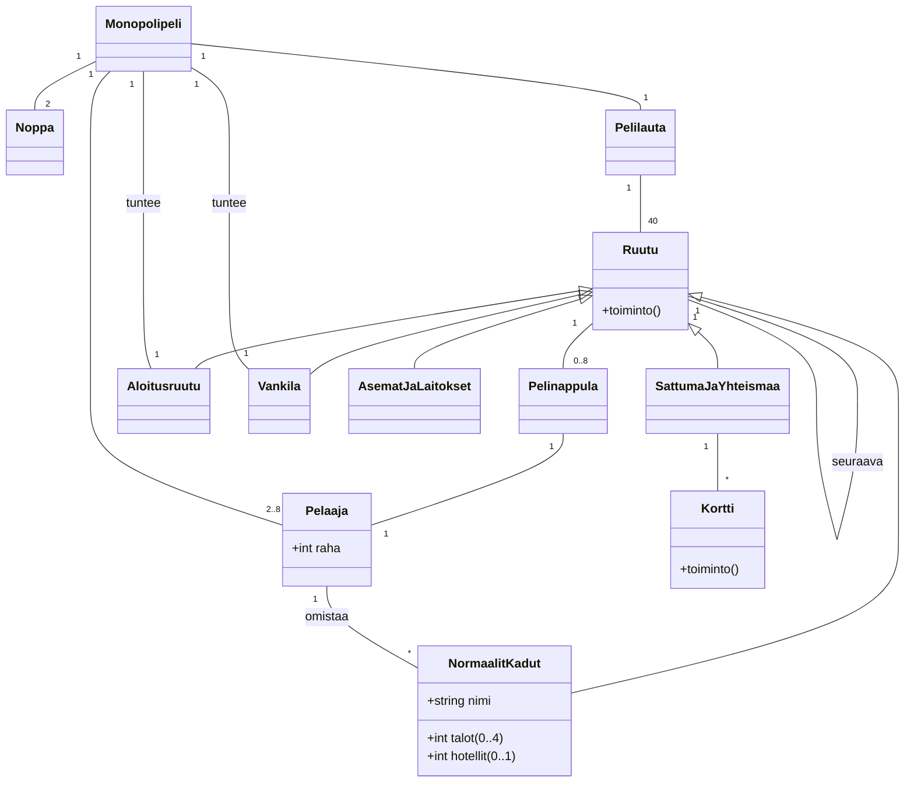

## Monopoli, alustava luokkakaavio

```mermaid
 classDiagram
    Monopolipeli "1" -- "2" Noppa
    Monopolipeli "1" -- "1" Pelilauta
    
    Ruutu <|-- SattumaJaYhteismaa
    Ruutu <|-- Aloitusruutu
    Ruutu <|-- Vankila
    Ruutu <|-- AsematJaLaitokset
    Ruutu <|-- NormaalitKadut

    Monopolipeli "1" -- "1" Aloitusruutu : tuntee
    Monopolipeli "1" -- "1" Vankila : tuntee

    Pelilauta "1" -- "40" Ruutu
    Ruutu "1" -- "1" Ruutu : seuraava
    Ruutu "1" -- "0..8" Pelinappula
    Pelinappula "1" -- "1" Pelaaja
    Pelaaja "2..8" -- "1" Monopolipeli
    Pelaaja "1" -- "*" NormaalitKadut : omistaa
    SattumaJaYhteismaa "1" -- "*" Kortti

    class Pelaaja {
        +int raha
    }

    class Ruutu {
        +toiminto()
    }

    class Kortti {
        +toiminto()
    }
    
    class NormaalitKadut {
        +string nimi
        +int talot(0..4)
        +int hotellit(0..1)
    }
```